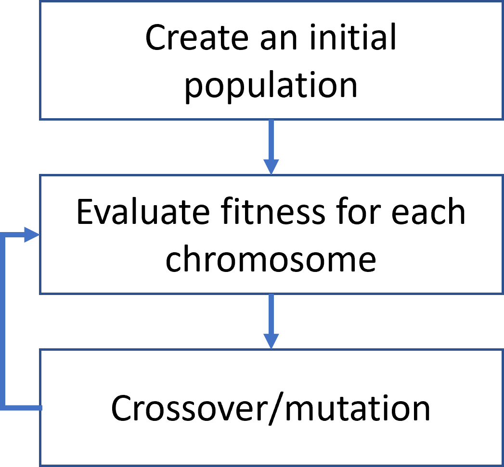

## Introduction

This is an example of how genetic algorithms can be used to play a game, Snake. The snake brain is modelled as a feed-forward network, making decisions whether to turn or keep going forward.

The algorithm can easily be adjusted to work in other applications.

## Thinking

Before each move, some measurements are made and fed into the snake brain. The measurements are made in eight directions, with 45 degrees between, centered around the snake head. For each direction, the snake measures the distance to a wall, whether or not there is food in that direction and if there is collision with the snakes' tail. With three measurements in each direction, there is a total of 24 measurements made. The order of the measurements are made in relation to the direction of the snake. First measurement is made to the bottom left of the snake, the next to the left, third to the top left and so on. Since the board is square, this is possible.

These measurements are feed into the snake's brain: a feed-forward network with three outputs. The outputs decides the next move: forward, left or right, all relative to the current direction of the snake. The number and size of hidden layers are configurable. Sigmoid is used as activation function.

## Evolution

We can interpret the weights and biases (floats) in a snake brain as genes, being the constituent parts of the chromosome.

Heuristic for updating weights and biases on the chromosones are based on concepts from evolution. After each generation, the most fit chromosomes are selected for breeding. Crossover of two chromosomes results in a new chromosome with genes from both parents. Uniform crossover is used in this project, meaning that genes (weights/biases) are selected randomly from the parents at each position.



## Graphics

SDL2 is used for rendering the game. The interst points that the snake can see (walls, food, tail) are rendered as overlay to the game board.

## Configuration

Parameters related to brain, game, graphics and evolution are managed from SnakeConfiguration. You can try changing rewards, penalties, brain size etc to speed up evolution and improve the results.

## Prerequisites

[SDL2](https://www.libsdl.org/) is used for rendering the game. 

To install with vcpkg (NB make sure to install with your prefered triplet):

```
vcpkg install sdl2 sdl2-ttf sdl2-image
```